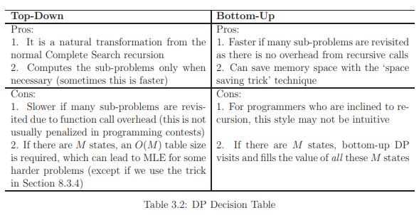

# List of Dynamic programming Sup topic's Resources, Tags, Terminologies and Explanations 

Table of Contents
================= 

- [Resources And Approximate Time](#resources-and-approximate-time)
- [Tags](#tags)
- [Resources From Books](resources-from-books)
- [Sup Topic Terminologies And Explanations](#sup-topic-terminologies-and-explanations)
  * [DP Intro](#dp-intro)
    + [Intro](#intro)
    + [Memoization](#memoization)
    + [Tableuztion](#tableuztion)
    + [Find Formula](#find-formula)
    + [Breaking Down Formula](#breaking-down-formula)
  * [Classical Problems](#classical-problems)
    + [Max 1D Range Sum](#max-1d-range-sum)
    + [Max 2D Range Sum](#max-2d-range-sum)
    + [Coin Problem](#coin-problem)
    + [Longest Increasing Subsequence](#longest-increasing-subsequence)
    + [Knapsack Problems](#knapsack-problems)
    + [Traveling Salesman Problem](#traveling-salesman-problem)
    + 
  * [Dont Be Greedy](#dont-be-greedy)
  * [Edit Distance](#edit-distance)
  * [Reconstructing The Path](#reconstructing-the-path)
  * [Counting Tilings](#counting-tilings)
   
   

## Resources And Approximate Time

Sup Topic Name   | Resources   | Approximate stydying   & solving time
-------------| -------------   |-------------   
**Sup Topic Name**|   | #
**Sup Topic Name** |   | #
**Sup Topic Name**|   | #

## Resources From Books
- **Competitive Programming 3**
  - DP Illustration 
  - Classical Examples 
  - Non-Classical Examples 
  - Solution to Non-Starred Exercises
- **Competitive Programmer’s Handbook**
  - Coin problem 
  - Longest increasing subsequence
  - Paths in a grid
  - Knapsack problems
  - Edit distance
  - Counting tilings 
- **PROGRAMMING CHALLENGES**
  - Don’t Be Greedy
  - Edit Distance 
  - Reconstructing the Path
  - Varieties of Edit Distance
  - Program Design Example: Elevator Optimization

## Tags
-
-

## Sup Topic Terminologies And Explanations

## DP Intro
### Intro
- When we use DP
  - When we solve a recursive problem that its sub-problems overlaps, hence calling sub-problems More than once and repeating its calculation in nature that typically makes the order exponentials!
  - When the original space is small enough to be memorized, then saving these sub-problems makes order small too, as sub-problems calculated once.
  - Dynamic Programming most typical cases: Minimization, Maximization and Counting. But could have adhock usages.
- Search space
  - Is the number of recursive calls, or how many times we are branching every time.
- Rules of DP
  - Recursive Function
  - Sub-calls Overlap
  - Small Search Space, so putting in memory is doable
### Memoization
- It is a technique when we have a recurive function and save calls
- We use it when we have [Sparse Calls](https://stats.stackexchange.com/questions/266996/what-do-the-terms-dense-and-sparse-mean-in-the-context-of-neural-networks)
- It's a top down approach
- In the top-down DP, the memo table entries are filled ‘as needed’ through the recursion itself.
### Tableuztion
- We use it when we have [Dense Calls](https://stats.stackexchange.com/questions/266996/what-do-the-terms-dense-and-sparse-mean-in-the-context-of-neural-networks)
- It's a bottom up approach
- In the bottom-up DP, we used a correct ‘DP table filling order’ to compute the values such that the previous values needed to process the current cell have already been obtained. This table filling order is the topological order of the implicit DAG
### 
### Find Formula
### Breaking Down Formula
## Classical Problems
### Max 1D Range Sum
### Max 2D Range Sum
### Coin Problem
### Longest Increasing Subsequence
### Knapsack Problems
###  Traveling Salesman Problem
## Dont Be Greedy
## Edit Distance
## Reconstructing The Path
## Counting Tilings

