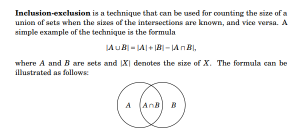
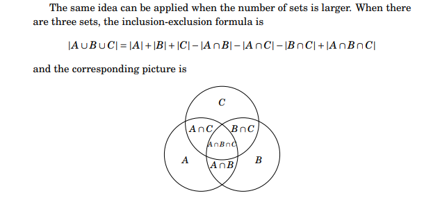

# List of Combinatorics Sup topic's Resources, Tags, Terminologies and Explanations 

Table of Contents
================= 

- [Resources And Approximate Time](#resources-and-approximate-time)
- [Tags](#tags)
- [Sup Topic Terminologies And Explanations](#sup-topic-terminologies-and-explanations)
  * [Introduction To Counting](#Introduction-to-counting)
    + [Product Rule](#product-rule)
    + [Sum Rule](#sum-rule)
    + [Inclusion Exclusion](#inclusion-exclusion)
    + [Divide Rule](#divide-rule)
    + [Permutations And Combinations](#permutations-and-combinations)
    + [Combinatorial Arguments](#combinatorial-arguments)
    + [Pascals Triangle](#pascals-triangle)
    + [Binomial Coefficients](#binomial-coefficients)
    + [The Pigeonhole Principle](#the-pigeonhole-principle)
  * [Partitions And Bijections](#partitions-and-bijections)
    + [Counting Subsets](#counting-subsets)
  * [Counting Sequences](#counting-sequences)
    + [Fibonacci Numbers](#fibonacci-numbers)
    + [Catalan Numbers](#catalan-numbers)
  * [Recurrence](#recurrence)
  * [Burnsides Lemma](#burnsides-lemma)
  * [Cayleys Formula](#cayleys-formula)

## Resources And Approximate Time

Sup Topic Name   | Resources   | Approximate stydying   & solving time
-------------| -------------   |-------------   
**Introduction To Counting** Product Rule Sum Rule  Inclusion Exclusion  Divide Rule Permutations And Combinations   Combinatorial Arguments  Pascals Triangle  Binomial   Coefficients  The Pigeonhole Principle| |#
**Partitions And Bijections**| | #
**Recurrence** | | #
**Counting Sequences**| | #
**Burnsides Lemma** | | #
**Cayleys Formula** || #

## Resources from books
- **Competitive Programming 3**
  - Fibonacci Numbers 
  - Binomial Coefficients 
  - Catalan Numbers 
- **Competitive Programmer’s Handbook**
  - Binomial coefficients 
  - Catalan numbers 
  - Inclusion-exclusion  (finish)
  - Derangements (Permutations)
  - Burnside’s lemma 
  - Cayley’s formula 
- **PROGRAMMING CHALLENGES**
  - Basic Counting Techniques   (finish)
  - Recurrence Relations 
  - Binomial Coefficients
  - Counting Sequences
  - Recursion and Induction
- **THE ART AND CRAFT OF PROBLEM SOLVING**
  - Introduction to Counting   (finish P&C)
  - Partitions and Bijections 
  - The Principle of Inclusion-Exclusion  (finish)
  - Recurrence
- **Discrete Mathematics and Its Applications**
  - The Basics of Counting  (finish)
  - The Pigeonhole Principle 
  - Permutations and Combinations   (finish)
  - Binomial Coefficients and Identities
  - Generalized Permutations and Combinations
  - Generating Permutations and Combinations 

## Tags
-
-

## Sup Topic Terminologies And Explanations

## Introduction To Counting
### Product Rule
- Suppose that a procedure can be broken down into a sequence of two tasks If there are |n1| ways(possibilities) to do the first task, there are |n2| ways(V) to do the second task, then there are |n1| x |n2| ways(possibilities) to do the procedure.
- **Product Rule Functions**
  - **Counting Functions** How many functions are there from a set with m elements to a set with n elements?
  - Means m elements in the domain may map to one of elements of n, for element m1 we have n choices, and for element m2 we have n choices, and so on, so we have (n * n * ... * n) = n^m.
  - **Counting One-to-One Functions** A function for which every element of the range of the function corresponds to exactly one unique element of the domain, so how many one-to-one functions are there from a set with m elements to one with n elements? it must be n >= m because every element in m must map to one eleemnt from n 
  - Means m elements in the domain may map to one unique elements of n, so for m1 we have n choices, and for m2 we have n-1
  choices (because the value used for a1 cannot be used again), so we have (n)(n − 1)(n − 2) ··· (n − m + 1).
### Sum Rule
- Suppose If a task can be done either in one of |n1| ways or in one of |n2| ways(possibilities), assuming the elements of n1 and n2 are distinct., then there are |n1| + |n2| ways(possibilities) to do the task.
### Inclusion Exclusion

- **AKA The Subtractoon Rule** If a task can be done in either |n1| ways or |n2| ways, then the number of ways to do the task is |n1| + |n2| minus the number of ways to do the task that are common to the two different ways.
- **General Computations for Inclusion Exclusion**
  - Enumerate all subset
  - Compute each intersection subset
  - If odd subset add (include) it -> S(1) s(1, 2, 3)
  - If even subset subtract (exclude) it -> S(1, 2) s(1, 2, 3, 4)
- To find the number of numbers divde by 2 or 3 to 100
  - 100/3 = 33, means 33 numbs dividd by 3, that we walk 3 and 3 and 3
  - 100/2 = 50, means 50 numbs duvded by 2
  - now find the common and remove it, 100/(2*3)
- **List of sets which we know how to count, so we can map other objects to them:** 
  - **Permutations** A permutation is an arrangement of n items, where every item appears exactly once. There are n! different permutations. The 3! = 6 permutations of three items are 123, 132, 213, 231, 312, and 321.
  - **Subsets** A subset is a selection of elements from n possible items. There are 2^n distinct subsets of n things. Thus there are 2^3 = 8 subsets of three items, namely, 1, 2, 3, 12, 13, 23, 123, and the empty set.
  - **Strings** A string is a sequence of items which are drawn with repetition. There are m^n distinct sequences of n items drawn from m items. The 27 length-3 strings on (123) are 111, 112, 113, 121, 122, 123, 131, 132, 133, 211, 212, 213, 221, 222, 223, 231, 232, 233, 311, 312, 313, 321, 322, 323, 331, 332, and 333.
### Divide Rule
- Suppose There are n/d ways to do a task if it can be done using a procedure that can be carried out in n ways, and for every way w, exactly d of the n ways correspond to way w.
### Permutations And Combinations
### Combinatorial Arguments
### Pascals Triangle
### Binomial Coefficients
### The Pigeonhole Principle

