# List of Mathematics Fundamentals Sup topic's Resources, Tags, Terminologies and Explanations 

Table of Contents
================= 

- [Resources And Approximate Time](#resources-and-approximate-time)
- [Tags](#tags)
- [Sup Topic Terminologies And Explanations](#sup-topic-terminologies-and-explanations)
  * [Arithmetic](#arithmetic)
    + [High Precision Integers](#high-precision-integers)
    + [High Precision Arithmetic](#high-precision-arithmetic)
    + [Numerical Bases And Conversion](#numerical-bases-and-conversion)
    + [Real Numbers](#real-numbers)
  * [Algebra](#sup-topic-name)
    + [Sets And Numbers And Functions](#sets-and-numbers-and-functions)
    + [Algebraic Manipulation Revisited](#algebraic-manipulation-revisited)
    + [Sequences And Summations And Product](#sequences-and-summations-and-product)
    + [Polynomials](#polynomials)
    + [Inequalities](#inequalities)
    + [Square Root](#square-root)
    + [Logarithms](#logarithms)
    + [Exponentiations](#exponentiations)
    + [Integer Functions](#integer-functions)
    + [Rrearrange The Equation](#rearrange-the-equation)
  * [Other](other)
    + [Grid](#grid)
    + [Finding Pattern Or Formula](#finding-pattern-or-formula)
    + [Mathematical Simulation](#mathematical-simulation)
   
   

## Resources And Approximate Time

Sup Topic Name   | Resources   | Approximate stydying   & solving time
-------------| -------------   |-------------   
**Arithmetic** |[Algebra & Arithmetic](http://www.differencebetween.info/difference-between-algebra-and-arithmetic) [Floating-Point Arithmetic](https://docs.oracle.com/cd/E19957-01/806-3568/ncg_goldberg.html) [Floating functions](https://www.geeksforgeeks.org/precision-of-floating-point-numbers-in-c-floor-ceil-trunc-round-and-setprecision/) |
**Algebra** |[Root Finding](https://en.wikipedia.org/wiki/Root-finding_algorithm#Newton's_method_(and_similar_derivative-based_methods))   |
**Other** |   |

## Tags
-
-

## Sup Topic Terminologies And Explanations

# Arithmetic
## High Precision Integers
- Representing truly enormous integers digits. by Arrays of Digits, (big int).
## High Precision Arithmetic
- Operations madde to the (big int) like (+, - , *, /)
## Numerical Bases and Conversion
*  The digit representation of a given radix-number is a function of which numerical base is used
   * **Binary** Base-2 numbers are made up of the digits 0 and 1. They provide theinteger representation used within computers, because these digits map naturally to on/off or high/low states.
   * **Octal** Base-8 numbers are useful as a shorthand to make it easier to read binary numbers, since the bits can be read off from the right in groups of three.
   * **Decimal** We use base-10 numbers because we learned to count on our tenfingers. 
   * **Hexadecimal** Base-16 numbers are an even easier shorthand to represent binarynumbers, once you get over the fact that the digits representing 10 through 15 are “A” to ‘’F.”
   * **Alphanumeric** Occasionally, one sees even higher numerical bases. Base-36 numbers are the highest you can represent using the 10 numerical digits with the 26 letters of the alphabet.
## Real Numbers
- **Integers** These are the counting numbers, −∞,..., −2, −1, 0, 1, 2,...,∞. Subsets of the integers include the natural numbers (integers starting from 0) and the positive integers (those starting from 1), there is always a rational number between any two rationals x and y ( (x+y)/2 is a good example).
- **Rational Numbers** These are the numbers which can be expressed as the ratio of two integers, c is rational if c = a/b for integers a and b. Every integer can be represented by a rational, namely, c/1. 
- **Irrational Numbers** are numbers that cannot be expressed as a fraction for any integers (there is no x/y equals any of these numbers). Irrational numbers have decimal expansions that neither terminate nor become periodic. There are many interesting numbers which are not rational numbers. Examples include π = 3.1415926..., √2 = 1.41421..., and e = 2.71828..., represnt them in a computer by  suffices to approximate them using the ten digits or so.
- **Fractions** Exact rational numbers x/y are best represented by pairs of integers x, y, where x is the numerator and y is the denominator of the fraction. The basic arithmetic operations on rationals c = x1/y1 and d = x2/y2 are easy to program:
- 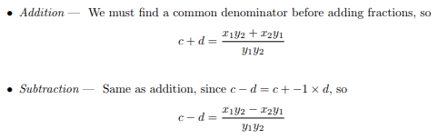
- 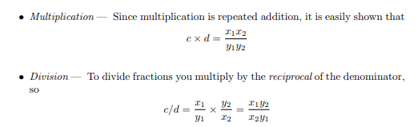
- **Hints**
  * Never test whether a float is equal to zero, or any other float for that matter. Instead, test if it lies within an  value plus or minus of the target.
# Algebra
## Sets And Numbers And Functions
### Definitions:
- **Sets** is an unordered collection of objects, called elements or members of the set. A set is said to contain its elements. We write a ∈ A to denote that a is an element of the set A. A set can contain no elements at all; this is the empty set 0 = {}. 
- **Set union** U (union) We define A UB to be the set each of whose elements is contained either in A or in B (or in both).
- **Set intersection**  n (intersection) We define A n B to be the set whose elements are contained in both A and B.
- **Subset** If all elements of a set A are contained in a set B, we say that A is a subset of B and write A ⊆ B. Note that A ⊆ A and 0 ⊆ A for all sets A.
- Two fundamental sets are the natural numbers N := {I, 2, 3,4, ... } and the integers Z := {O, ±1,±2,±3, ±4, ... }.
- **Set subtraction** A - B := {a ∈ A : a no∈ B}; 
- **Power Sets** the power set of S is the set of all subsets *all combinations of elements of a set* of the set S. The power set of S is denoted by P(S).
- **Function** A relation in which each input has only one output. Often denoted f(x).
- **Range** The set of all outputs of a relation or function.
- **Domain** The set of all inputs of a relation or function.
## Algebraic Manipulation Revisited
- **Algebra basic formulas**
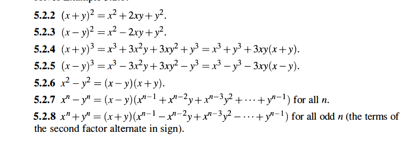
- **Manipulating Squares**
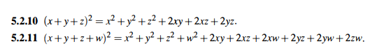
## Sequences And Summations And Product
- **Sequences** A sequence is a function from a subset of the set of integers (usually either the set{0, 1, 2,...} or the set {1, 2, 3,...}) to a set S. 
  * **Geometric progression** is a sequence of the form {a, ar, ar^2,... , ar^n,...} where the initial term a and the common ratio r are real numbers.
  * **Arithmetic progression** is a sequence of the form {a, a + d, a + 2d,... ,a + nd, ...} where the initial term a and the common difference d are real numbers.
  * **Recurrence relation** the sequence {an} is an equation that expresses an in terms of one or more of the previous terms of the sequence, namely, a0, a1,...,an−1, for all integers n with n ≥ n0, where n0 is a nonnegative integer.
    * **The initial conditions** for a recursively defined sequence specify the terms that precede the first term where the recurrence relation takes effect.
    * We say that we have solved the recurrence relation together with the initial conditions when we find an explicit formula, called a **closed formula**, for the terms of the sequence
  * **The Fibonacci sequence** {f0, f1, f2,..., }is defined by the initial conditions f0 = 0, f1 = 1, and the recurrence relation fn = fn−1 + fn−2 for n = 2, 3, 4,....
- **Summations Notation**
  * A large uppercase Greek letter sigma Σ (sigma) i, is used to denote summation.
  * am, am+1,...,an. from the sequence {an}. We use the notation  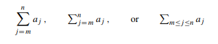 
     * the variable j is called the index of summation, and the choice of the letter j as the variable is arbitrary; 
     * the index of summation runs through all integers starting with itslower limit m and ending with its upper limit n.
    * 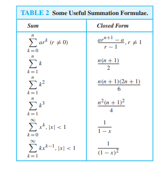
    * **SUM OF EVEN NUMBERS:** Formula: N(N+1), How to Find N = (First Even + Last Even)/2 - 1 
    * **SUM OF ODD NUMBERS:** Formula: N^2, How to Find N = (First Odd + Last Odd)/2 
- **Product Notation**
  * A large uppercase Greek letter, π (pi) is used to denote product 
  * ak, ak+1,...,an. from the sequence {an}. We use the notation 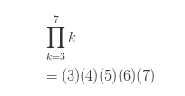
     *  the variable k is called the index of summation, and the choice of the letter k as the variable is arbitrary; 
     * the index of summation runs through all integers starting with itslower limit k and ending with its upper limit 7.
## Polynomials
### Definition:
- **Polynomials** is a mathematical expression consisting of a sum of terms, each term including a variable or variables raised to a power and multiplied by a coefficient.
- Polynomial degree is the highest term in it.
- **Form:**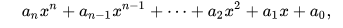
- **Polynomial Operations** 
  * **Solve Polynomial** Find (roots) values which make f(x) = 0, (evaluate the values that make it = 0).
  * 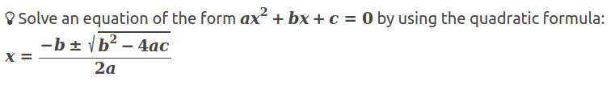
  * Beyond quadratic equations, numerical methods are typically used,  including Newton’s method and Newton-Raphson, But the basic idea is that of binary search, However, a simpler method to find the ith root of t uses exponential functions and logarithms to compute t^1/i.
  * **Evaluation**  Computing P(x) for some given value x.
  * **Addition/Subtraction** Simply add or subtract the coefficients of the ith terms(must add terms that have the same degree and the same vars) for all i from zero to the maximum degree.
  * **Multiplication** The product of polynomials P(x) and Q(x) is the sum of the product of every pair of terms, where each term comes from a different polynomial.
## Inequalities
- Inequalities are important because many mathematical investigations involve estimations, optimizations, best-case and worst-case scenarios.
- **Basic Arithmetic**
   * **Transitivity**
     * For any real numbers a, b, c:
     * If a ≥ b and b ≥ c, then a ≥ c
     * If a ≤ b and b ≤ c, then a ≤ c
     * If a ≥ b and b > c, then a > c
     * If a > b and b ≥ c, then a > c
     * If a = b and b > c, then a > c
     * If a > b and b = c, then a > c 
  * **Converse**
    * If a ≤ b, then b ≥ a
    * f a ≥ b, then b ≤ a
   * **Addition and subtraction** 
     * If a ≥ b and c ≥ d, then a + c ≥ b + d
     * If a ≥ b, then a + c ≥ b + c and a − c ≥ b − c.
   * **Multiplication and division** 
     * If a ≥ b and c > 0, then ac ≥ bc and a/c ≥ b/c
     * If a ≤ b and c > 0, then ac ≤ bc and a/c ≤ b/c
     * If a ≥ b and c < 0, then ac ≤ bc and a/c ≤ b/c
     * If a ≤ b and c < 0, then ac ≥ bc and a/c ≥ b/c
   * **Additive inverse**
     * If a ≤ b, then −a ≥ −b
   * **Multiplicative inverse**
     * If a ≤ b, then 1/a ≥ 1/b, provided that both a and b have the same sign. 
     * **In chained notation**
       * If 0 < a ≤ b, then 1/a ≥ 1/b > 0.
       * If a ≤ b < 0, then 0 > 1/a ≥ 1/b.
       * If a < 0 < b, then 1/a < 0 < 1/b.
       * If 0 > a ≥ b, then 1/a ≤ 1/b < 0.
       * If a ≥ b > 0, then 0 < 1/a ≤ 1/b.
       * If a > 0 > b, then 1/a > 0 > 1/b.
## Square Root 
* **Multiply Roots**
   * 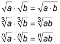
* **Divide Roots**
   * 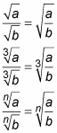
* **Root of a Root**
   * 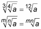
* **Root and Power**
   * 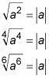
   * 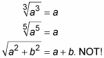
   * 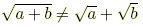
   * 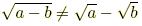
* **Convert into a Power**
   * 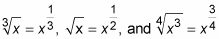
   * 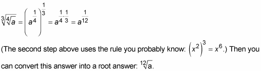
* **Distributing**
   * 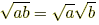
   * 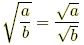
   * 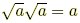
   * 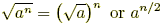
* **Rationalizing the Denominator**
   * 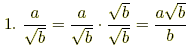
   * 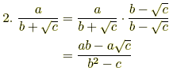
   * 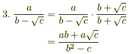
   * 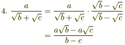
   * 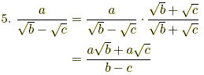
## Logarithms
* A logarithm is simply an inverse exponential function. Saying b^x = y is equivalent to saying that x = logb y.
* log x always refers to log base 10, i.e., log x = log 10 x.
* ln x is called the natural logarithm and is used to represent log ex, where the irrational number e ≈ 2.71828. Therefore, ln x = y if and only if e^y = x.
* For any other base it is necessary to use the change of base formula: 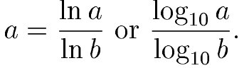
* **Properties of Logarithms** (logs are only defined for positive values of x)
  * 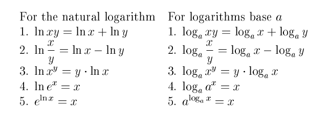
  * 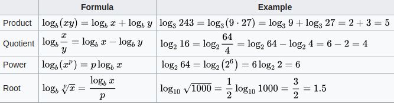
* **Useful Identities for Logarithms**
  * 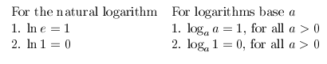
## Exponentiations
* Exponent is the base a raised to the power of n is equal to the multiplication of a, n times.
* **Properties of Exponents** (where and b be real numbers and m and n be integers)
* 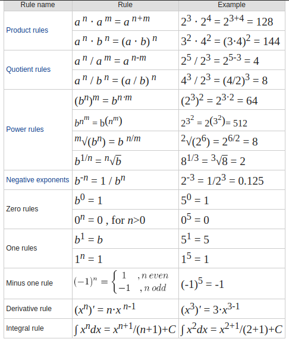
* 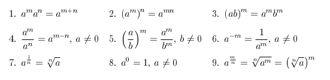
## Integer Functions
## Rrearrange The Equation
# Other
## Grid
## Finding Pattern or Formula
## Mathematical Simulation
-
