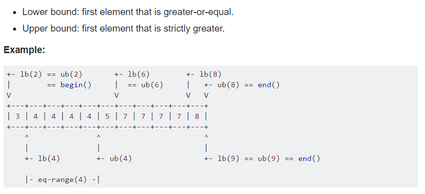

# Problem Solving Paradigms

Table of Contents
================= 

- [Brute Force](#brute-force)
  * [Iterative](#iterative)
    + [Iteratively Subsets](#iteratively-subsets)
  * [Recursive](Recursive)
    + [Recursively Subsets](#recursively-subsets)
- [Greedy](#greedy)
  * [Tag](#tag)
- [Divide And Conquer](#divide-and-conquer)
   * [Binary Search](#binary-search)
     + [Normal BS](#normal-bs)
     + [BS In C++](#bs-in-c++)
     + [Bisection Method](#bisection-method)
     + [BS The Answer](#bs-the-answer)
     + [Find Min Value](#find-min-value)
     + [Find Max Value](#find-max-value)
- [Sliding Window](#sliding-window)
   
   
## Brute Force
### Iterative
#### Iteratively Subsets 
- Basic code
  ```cpp 
  int main()
  {
        string all, fi;
        cin >> all;
        fi += all[0];
        vector<string>subset;
        subset.push_back(fi);
        subset.push_back("");
        for (int x = 1; x < all.length(); x++)
        {
                int t = subset.size();
                for (int y = 0; y < t; y++)
                        subset.push_back(subset[y] + all[x]);
        }
        for (int x = 0; x < subset.size(); x++)
                cout << subset[x] << endl;
        return 0;
                                       
   }
  ```

### Recursive
#### Recursively Subsets
- Basic code
  ```cpp 
  string all;
  vector<string>subset;
  void gensubset(int index, string sup)
  {
        // the end of recursion call (leaf)
        if (index == all.length())
        {
                subset.push_back(sup);
                return;
        }

        gensubset(index + 1, sup);
        gensubset(index + 1, sup += all[index]);
  }

  int main()
  {
        cin >> all;
        gensubset(0, "");
        for (int x = 0; x < subset.size(); x++)
                cout << subset[x] << endl;

        return 0;
  }

  ```
  
## Greedy
### Tag

## Divide And Conquer
### Binary Search
#### Normal BS
- Binary Search Iteration code:
- Performs approximately O(log2(N))
- **NOTE:** We write mid = start + (end - start) / 2; instead of mid = (start + end) / 2; in case We having big integers so when we sum it first then divide it it may overflow and give us a wrong position, anyway they both are equivalent.
```cpp
/*
Function: Binary Search
Searching for a specific value in a sorted vector.

Parameters:
vec - the vector that we will search in.
value - the value that we want to find it.
size- the size of the vector

Returns:
-if we find the value it returns it's position(index).
-if we didn't find it returns -1.

*/
int BinarySearch(vector<int> vec, int value, int size)
{
	int start = 0, end = size - 1, mid;
	while (start <= end)
	{
		mid = start + (end - start) / 2;
		if (value == vec[mid])return mid;
		else if (value < vec[mid])end = mid - 1;
		else start = mid + 1;
	}
	return -1;
}

```
#### BS In C++
 
- Return iterator to lower bound or upper bound:
- Performs approximately log2(N)+1
```cpp
/*
Function:lower-bound, upper-bound and equal-range.

Parameters:
- The range used is [first,last), which contains all the elements between first and last, 
including the element pointed by first but not the element pointed by last.
- The value we want to lower, upper bound or equal range to search in that range.

Returns:
- An iterator to the lower bound or upper bound  of val in the range.
- If all the element in the range compare less than val, the function returns last, or no element
equivalent to val, then return the nearest element greater than val

- In case of Equal ramge returns the initial and the final bound of such a sub-range.
- If there is no element equivalent to val, then both first and second points to the nearest element
greater than val, or if val is greater than any other value, then both of them point to last.

Note: We subtract the iterator from the pointer of the beginning of the vector to know the index of it.
*/
	vector<int>::iterator low, up;
	low = lower_bound (vec.begin(), vec.end(), value);
	up = upper_bound (vec.begin(), vec.end(), value);
	int low1 = low - vec.begin(), up1 = up - vec.begin();
	
        pair<vector<int>::iterator, vector<int>::iterator> er;
	er = equal_range(v.begin(), v.begin(), value;
	int erfi = er.first - v.begin(), erse.second - v.begin();
	
        // Or
	auto low = lower_bound(vec.begin(), vec.end(), value);
	auto up  = upper_bound(vec.begin(), vec.end(), value);
	auto er  = equal_range(vec.begin(), vec.end(), value);
```
#### Bisection Method
#### BS The Answer
#### Find Min Value
#### Find Max Value
